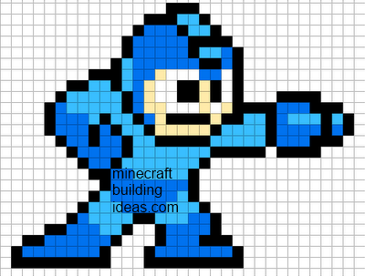

Criando **minha** _pagina_  ~~principal~~.

# Quem sou eu

Aluno de jogos aprendendo a fazer um portfólio com o professor Marcelo.

* * *

# Portfólio

## Games

### Elements
 
   
 
### Super Chef
 
   
 
### Tower Defense
 
   
 
### Fuga das Vacas
 
  
 
 

## Artes

## Projetos

* Proj Teatro  
* Proj Musica  
* Proj Jogos  

1. Marcelo  
2. Saulo  
3. Paulo  

## Animações

### Robô

#### Pulando
  
#### Atacando
  
#### Andando
  
#### Correndo
  

* * *

** negrito  
_ itálico  
~~ riscado  
3 * linha horizontal(barra)   
#S uma ou mais hashtags criam capitulos ou subcapitulos  
*s asteriscos adiciona lista não ordenada  
1s numeros criam lista ordenada  

* * *
