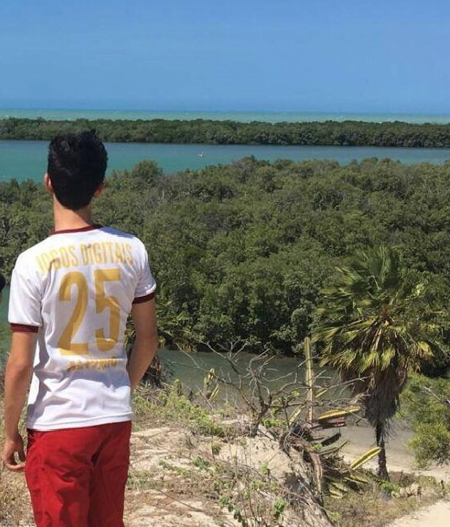
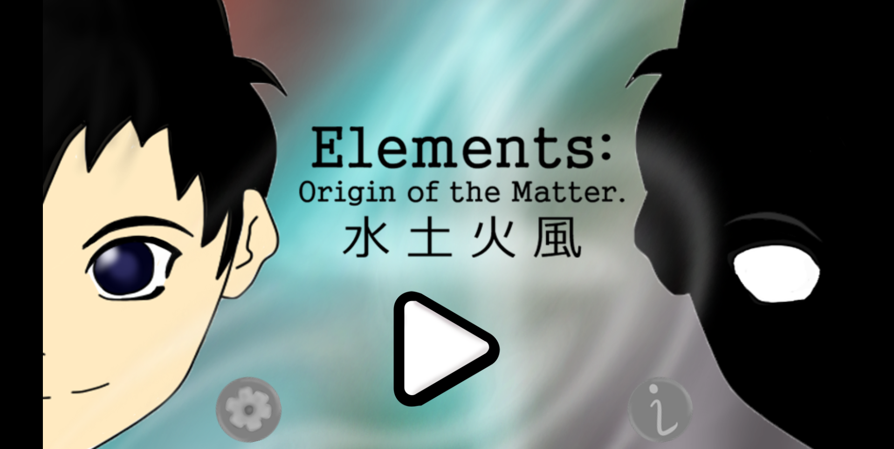
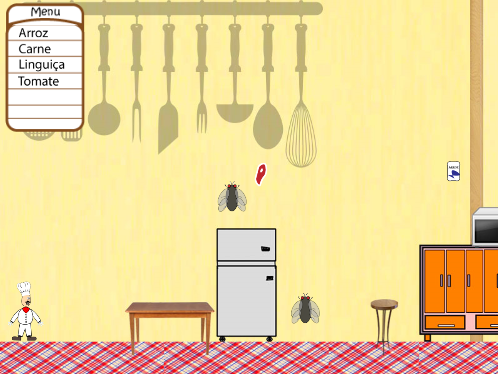
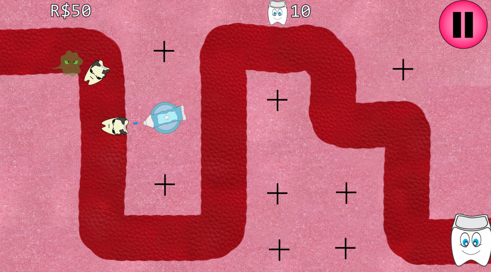
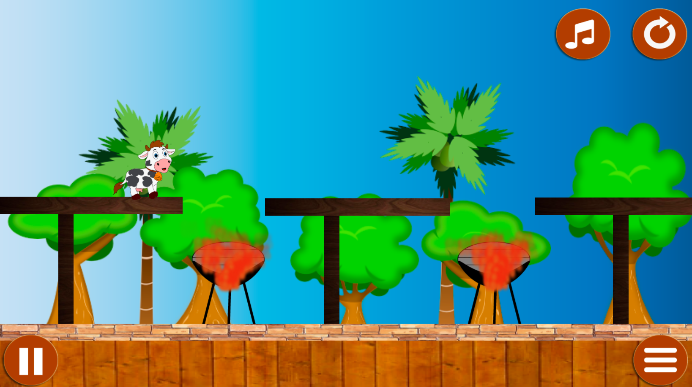
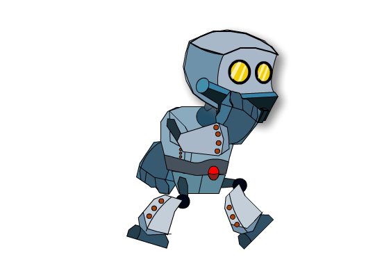

Criando **minha** _pagina_  ~~principal~~.

# Quem sou eu

Meu nome é Álvaro Medeiros Dantas, tenho 16 anos e sou aluno de jogos digitais no IFRN campus Ceará Mirim.

* * *

# Portfólio

## Games

* Elements
 
   
 
* * * 
 
* Super Chef
 
   

* * *

* Tower Defense
 
   

* * *

* Fuga das Vacas
 
  
 
* * *

## Artes

### Pixel Art

* Papai Smurf
  

* Smurfete
  

## Projetos  

Projeto Integrador: (xxx)

## Animações

### Robô

* Pulando  

  

* * *
* Atacando  

  

* * *
* Andando  

  

* * *
* Correndo  

  

* * *

# Contatos

Facebook:  [Álvaro Dantas](https://www.facebook.com/profile.php?id=100006526025595)  

Instagram: [alvaro_dantas5](https://www.instagram.com/alvaro_dantas5/)  

Email: alvarodantas@hotmail.com

* * *

** negrito  
_ itálico  
~~ riscado  
3 * linha horizontal(barra)   
#S uma ou mais hashtags criam capitulos ou subcapitulos  
*s asteriscos adiciona lista não ordenada  
1s numeros criam lista ordenada  

* * *
